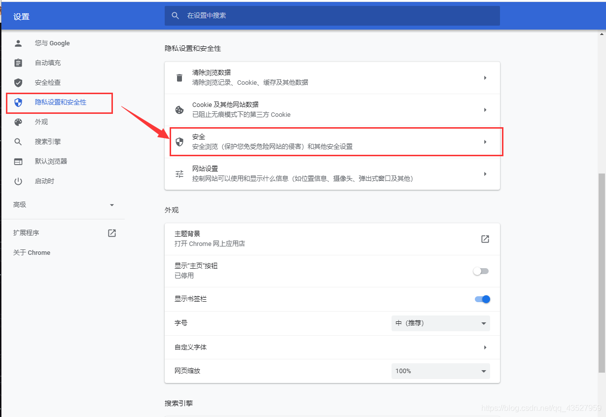
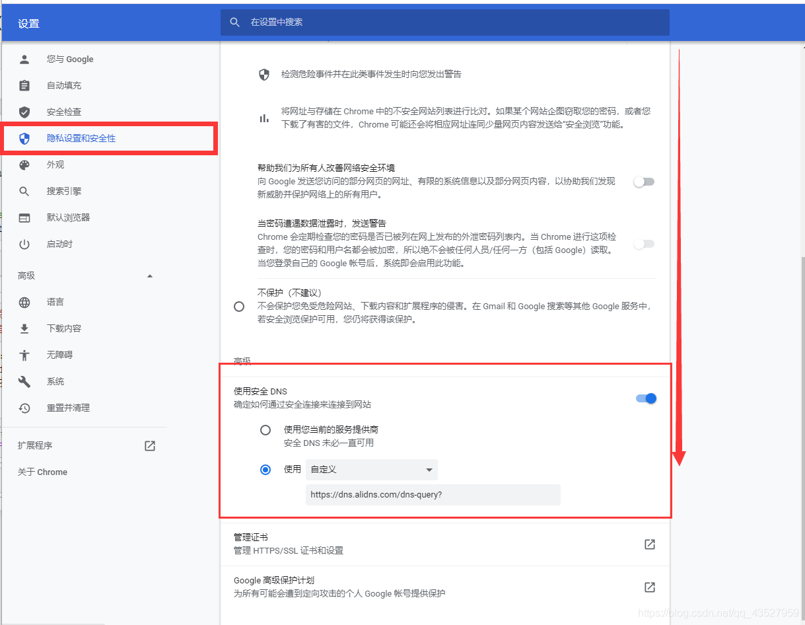

打开网页速度变慢：

[参考解决方案](https://blog.csdn.net/qq_43527959/article/details/115422414?spm=1001.2101.3001.6661.1&utm_medium=distribute.pc_relevant_t0.none-task-blog-2%7Edefault%7ECTRLIST%7ERate-1-115422414-blog-124961593.pc_relevant_multi_platform_whitelistv4&depth_1-utm_source=distribute.pc_relevant_t0.none-task-blog-2%7Edefault%7ECTRLIST%7ERate-1-115422414-blog-124961593.pc_relevant_multi_platform_whitelistv4&utm_relevant_index=1)

- 打开google浏览器的设置–> 隐私设置和安全性 --> 安全



- 进入后往下滑，找到DNS,默认的是第一个选项，改成第二个选择国内的镜像DNS



境内：阿里公共DNS（阿里公共DNS安全传输服务）

```
https://dns.alidns.com/dns-query?
https://alidns_ip/dns-query?
```

修改完后重启浏览器，开始你的秒开页面的美妙时光吧。
（这是最近最主要的导致打开网页变慢的问题，如果还是没能缓解可以尝试一下集中方式）
