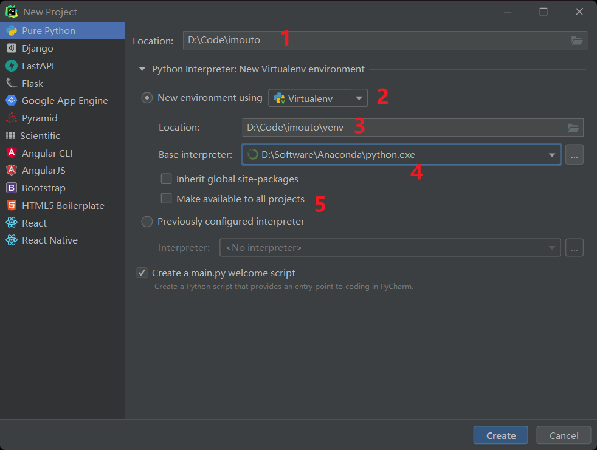
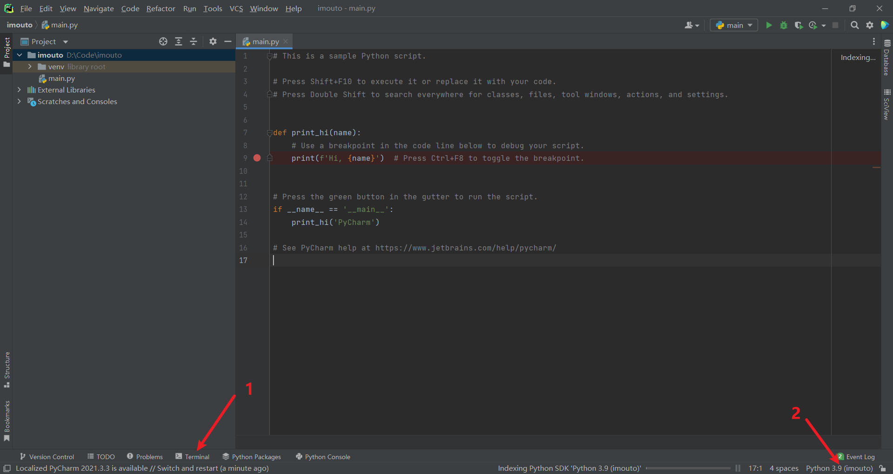
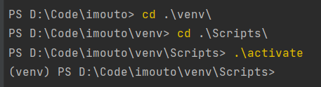
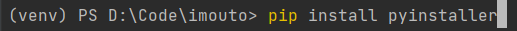
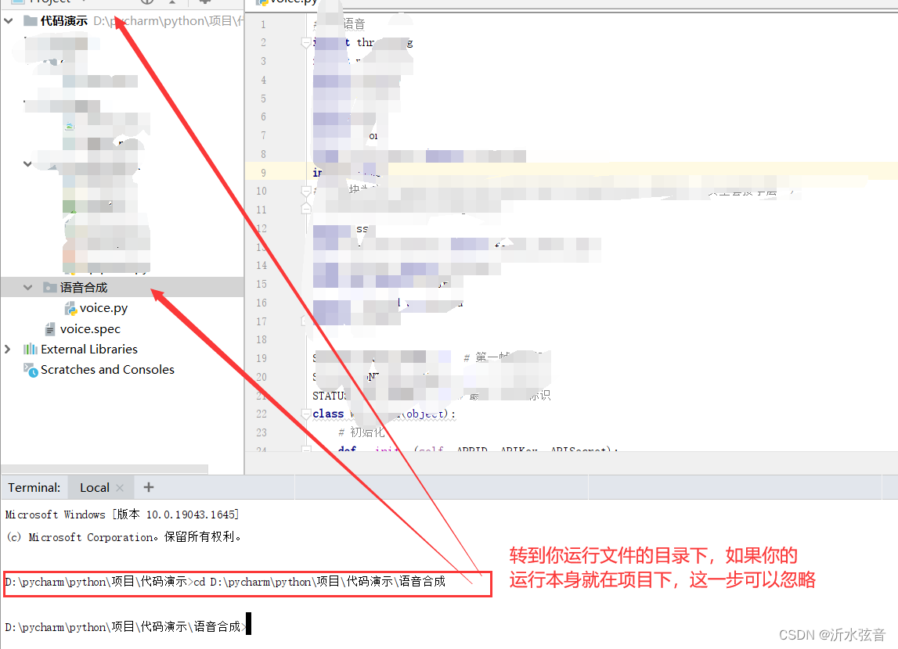
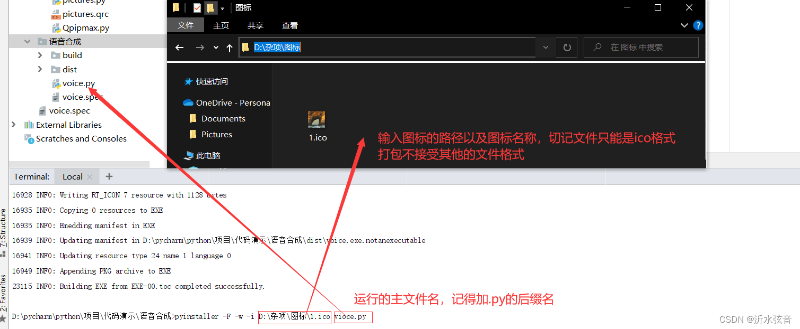
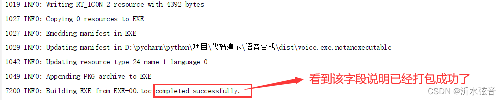
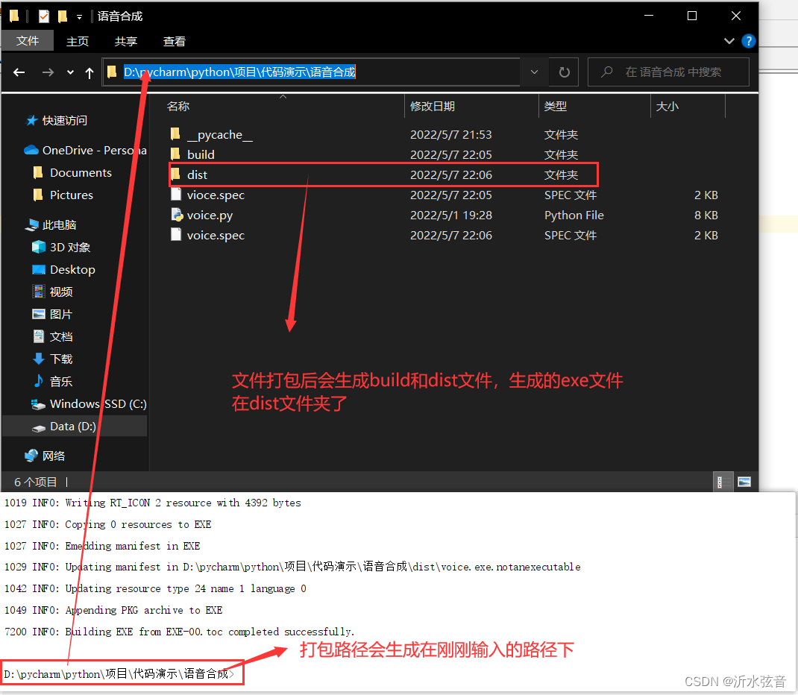
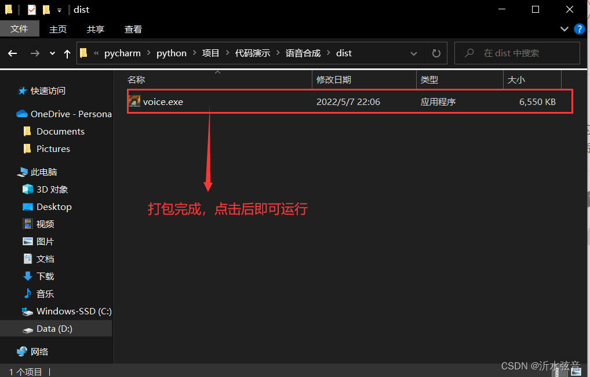

# python项目创建与打包注意事项

## Pre-Project

​	在创建项目之前, 最好创建一个虚拟开发环境, 将项目放置于这个虚拟环境中开发, 虽然这回导致需要重新安装第三方库, 但最终打包时可以避免打包全局环境中其他不需要的库, 从而减少打包时间, 也减小了最终可执行项目的体积.

### 1. 安装Virtualenv

```shell
pip install virtualenv
```

### 2. 新建Pycharm项目

​	要注意图中标出的几个点:



- 点1: 整个项目的地址
- 点2: 选择"New environment using Virtualenv", 表示我们要新建一个虚拟环境
- 点3: 这里的"Location"是指虚拟环境创建的地址, 选择哪, 就创建在哪里, 一般跟随默认选择在项目地址当中
- 点4: 这里选择基础解释器, 跟随默认选择之前配置好的anaconda下的python解释器就好
- 点5: 这里选择后就可以让其他项目也能使用这个虚拟环境了,  如果该虚拟环境对很多项目都通用可以按需求勾选
- 最后点击Create创建项目

### 3. 配置新虚拟环境

​	项目创建完成后如下图所示



- 点1: 调用终端, 启动次此虚拟环境:

  ```shell
  cd .\TEST_env
  cd .\Scripts
  .\activate
  ```

  

- 当前面出现虚拟环境名venv时, 便说明已经成功进入此环境, 可以利用pip安装依赖包了.
- 点2: 右下角此时也显示使用的解释器是我们创建的虚拟环境.

## After-Project

### 1. 下载pyinstaller库

​	注意是在虚拟环境中安装, 所以要用pycharm的terminal而不是anaconda自带的terminal.



### 2. 转入要打包的项目对应的路径下



### 3. 在terminal中输入打包代码



### 4. 完成打包





